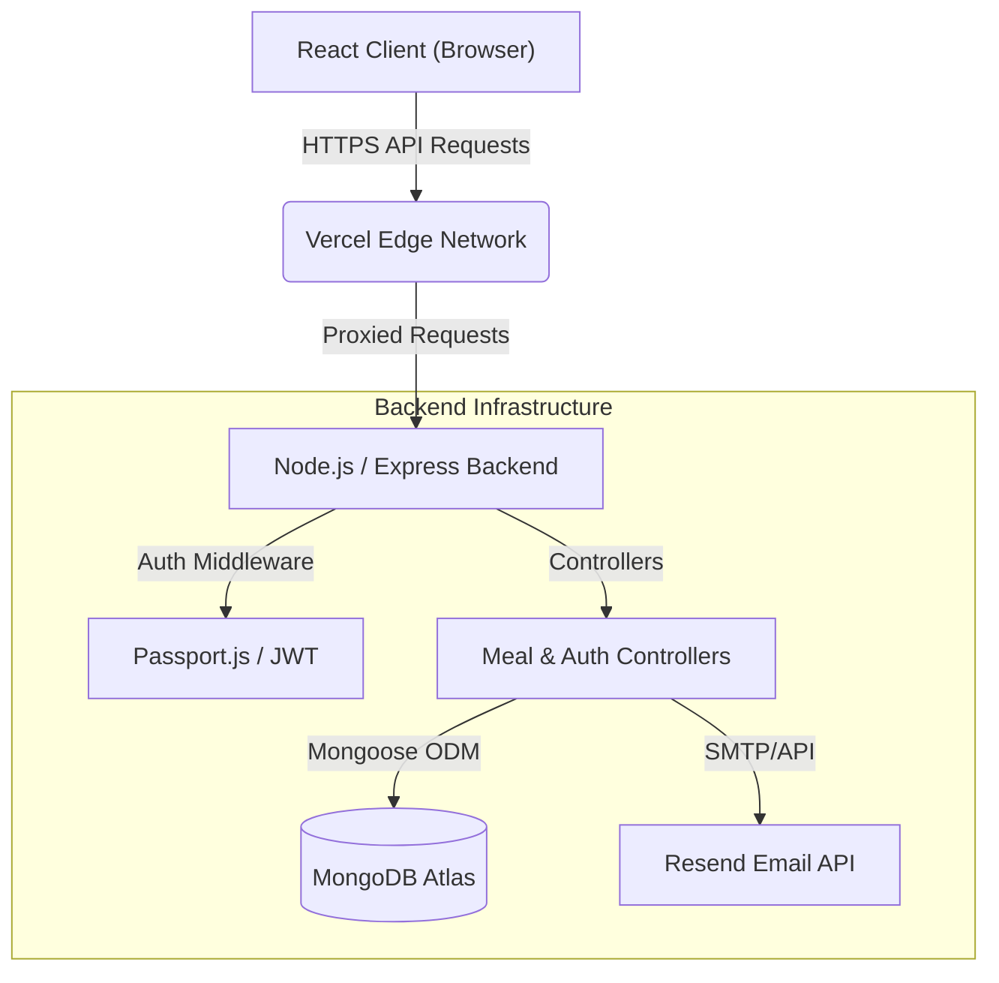
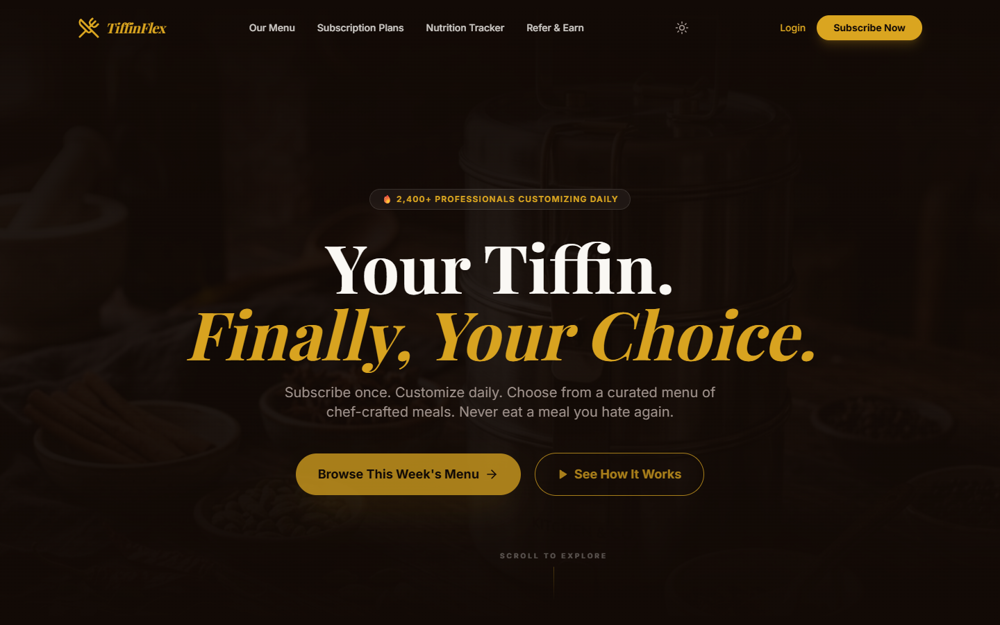
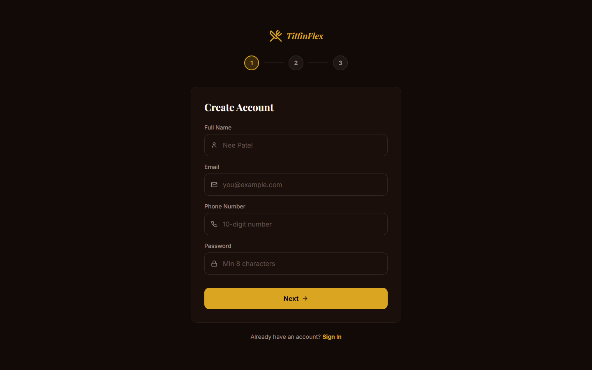
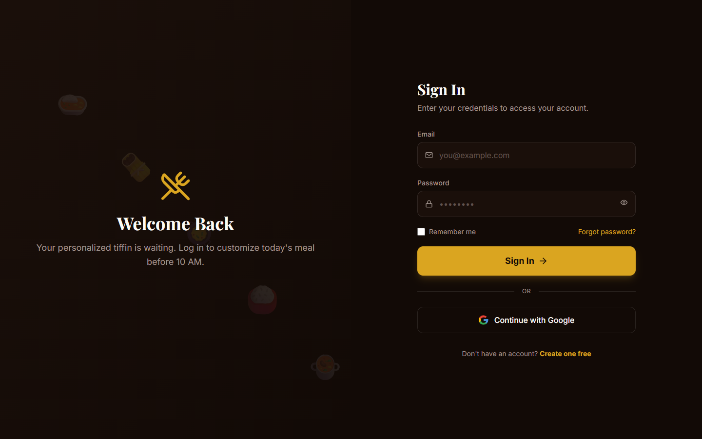

# 🍱 TiffinFlex


> A premium, full-stack MERN web application designed to revolutionize the traditional tiffin delivery system by introducing flexibility, complete dietary customization, and an elegant digital experience.

## 📎 Important Links

| Resource | Link |
|----------|------|
| **Figma Design** | [View Figma Mockups](https://www.figma.com/design/dFyEuSN5vcs57WZQup2XO8/Untitled?node-id=14-3&t=FVQOA6rq9WHwTOUw-1) |
| **Live Project** | [View Deployed Frontend](https://tiffin-flex.vercel.app) |
| **Backend API** | [View Deployed Backend](https://tiffinflex.onrender.com) |
| **Postman Docs** | [View API Documentation](https://documenter.getpostman.com/view/50839260/2sBXqKofJx) |
| **YouTube Demo** | [Watch Project Demo](#) |

---

## 1. 📌 Project Overview
TiffinFlex introduces a flexible, user-centric approach to tiffin delivery services. Instead of receiving fixed, monotonous daily menus, subscribers can dynamically customize and swap meals from a daily catalog using a credit-based subscription model. 

It solves the widespread problem of food waste and subscriber dissatisfaction caused by rigid catering schedules. Built for working professionals and students who demand dietary control, TiffinFlex differentiates itself from traditional alternatives by offering real-time macronutrient tracking, allergen-aware meal filtering, and a seamless zero-friction user interface.

---

## 2. 🏗 Architecture



### Component Breakdown
* **Client (React + Redux Toolkit)**: Manages UI state, handles caching, and performs optimistic UI updates for meal swaps.
* **API Gateway (Express)**: RESTful application server acting as the source of truth, enforcing CORS, JWT validation, and RBAC (Role-Based Access Control).
* **Data Layer (MongoDB Atlas)**: NoSQL document store persisting Users, Meals, and Subscriptions.

**Data Flow**: When a user swaps a meal, the React client dispatches a Redux thunk. The Axios interceptor attaches the JWT. The Express router validates the token, the controller checks meal availability, updates the MongoDB document, and returns the new menu state.

---

## 3. 🚀 Features

### 👤 For Subscribers
* **Flexible Meal Swapping**: Browse alternative meals for any day of the week and swap your default tiffin assignment instantly without penalty.
* **Nutrition Tracking Dashboard**: Real-time visualization of daily calorie and macronutrient intake (Proteins, Carbs, Fats) aggregated from selected meals.
* **Robust Authentication**: Supports local Email/Password registration with OTP email verification (via Resend) alongside seamless Google OAuth 2.0 integration.
* **Dietary Customization**: Users can configure persistent profiles defining spice tolerance, strict diets (Vegan, Keto), and allergen exclusions.

### 🛡️ For Providers (Admins)
* **Menu Management Console**: A protected interface enabling complete CRUD (Create, Read, Update, Delete) operations over the meal database.
* **Analytics Dashboard**: Aggregated views of active subscriptions, total revenue, and popular meal choices to assist kitchen planning.

---

## 4. ⚙️ Tech Stack

| Dependency | Version | Purpose |
|------------|---------|---------|
| **Frontend** | | |
| `react` / `react-dom` | `^19.2.5` | Core UI library utilizing concurrent features. |
| `@reduxjs/toolkit` | `^2.11.2` | Predictable, centralized state management and async thunks. |
| `tailwindcss` | `3.4.4` | Utility-first CSS framework for rapid UI development. |
| `framer-motion` | `^11.0.0` | Orchestrates cinematic page transitions and micro-interactions. |
| `vite` | `^8.0.10` | Next-generation frontend tooling and bundler. |
| **Backend** | | |
| `express` | `^5.2.1` | Web framework handling routing and middleware execution. |
| `mongoose` | `^9.5.0` | Object Data Modeling (ODM) for MongoDB interactions. |
| `jsonwebtoken` | `^9.0.3` | Generates and verifies stateless authentication tokens. |
| `passport` / `passport-google-oauth20`| `^0.7.0` | Strategy-based authentication middleware for Google sign-in. |
| `resend` | `^3.5.0` | Transactional email provider for OTP delivery. |

---

## 5. 💻 Installation & Setup

**Prerequisites:**
* Node.js `>= 18.x.x`
* MongoDB instance (Local or Atlas)

**1. Clone the repository**
```bash
git clone https://github.com/neev3654/tiffinFlex.git
cd tiffinFlex
```

**2. Backend Setup**
```bash
cd backend
npm install
cp .env.example .env
# Open .env and configure MONGODB_URI and JWT_SECRET
npm run dev
```

**3. Frontend Setup**
```bash
cd ../frontend
npm install
cp .env.example .env
# Ensure VITE_API_URL is pointing to your backend (e.g., http://localhost:5000/api)
npm run dev
```

---

## 6. 📖 Usage & API Reference

### Quick Start Example
To programmatically retrieve the active meal catalog:
```javascript
const response = await fetch('http://localhost:5000/api/meals', {
  method: 'GET',
  headers: { 'Authorization': `Bearer YOUR_JWT_TOKEN` }
});
const meals = await response.json();
console.log(meals);
```

### Core API Endpoints

**Auth Routes (`/api/auth`)**
| Method | Endpoint | Params/Body | Returns | Description |
|--------|----------|-------------|---------|-------------|
| `POST` | `/register` | `{name, email, password}` | `{message, requiresVerification}` | Creates user & triggers OTP |
| `POST` | `/verify-otp` | `{email, otp}` | `{token, user}` | Validates OTP and returns JWT |
| `POST` | `/login` | `{email, password}` | `{token, user}` | Authenticates existing user |
| `GET` | `/me` | *Requires Auth Header* | `User Object` | Fetches current user profile |

**Meal Routes (`/api/meals`)**
| Method | Endpoint | Params/Body | Returns | Description |
|--------|----------|-------------|---------|-------------|
| `GET` | `/` | `?active=true` | `Array<Meal>` | Retrieves catalog (public) |
| `POST` | `/` | `Meal Object` | `Meal Object` | Creates meal (Admin only) |
| `PUT` | `/:id` | `Partial<Meal>` | `Meal Object` | Updates meal (Admin only) |
| `DELETE` | `/:id` | *None* | `{message}` | Deletes meal (Admin only) |

---

## 7. 🔐 Environment Variables

### Backend (`backend/.env`)
| Variable | Required | Default | Description |
|----------|----------|---------|-------------|
| `PORT` | No | `5000` | Port for the Express server to listen on. |
| `MONGODB_URI` | **Yes** | None | Connection string for MongoDB database. |
| `JWT_SECRET` | **Yes** | None | Cryptographic key used to sign session tokens. |
| `FRONTEND_URL` | **Yes** | None | Used for CORS whitelisting and OAuth redirects. |
| `RESEND_API_KEY` | **Yes** | None | API key for transactional email delivery. |
| `GOOGLE_CLIENT_ID` | No | None | OAuth 2.0 client ID for Google SSO. |
| `GOOGLE_CLIENT_SECRET` | No | None | OAuth 2.0 client secret. |

### Frontend (`frontend/.env`)
| Variable | Required | Default | Description |
|----------|----------|---------|-------------|
| `VITE_API_URL` | **Yes** | None | Base URL pointing to the Express backend API. |

---

## 8. 🤝 Contributing

We welcome contributions! 

1. **Development Setup:** Ensure your local environment matches the exact Node versions defined in `package.json`.
2. **Code Style:** We utilize default `react-app` ESLint configurations. Run `npm run lint` before committing.
3. **Commit Conventions:** Please use clear, imperative commit messages (e.g., `Fix OTP validation fallback`).
4. **Pull Requests:** Open a PR against the `main` branch. Ensure you update relevant documentation if altering the API surface.

---

## 9. ⚡ Performance & Benchmarks

* **Lazy Loading:** Frontend routes are aggressively code-split using `React.lazy` and `Suspense`, keeping the initial JS bundle under 200kb.
* **Asset Optimization:** Images are expected to be served via CDN. Animations via Framer Motion utilize hardware acceleration (`transform`/`opacity`).
* **Backend Scalability:** MongoDB models utilize indexing on frequently queried fields like `email` and `category`. The Node.js event loop remains unblocked by offloading heavy cryptography (`bcryptjs`) appropriately.

---

## 10. 🧪 Testing
*(Note: Automated test suites are currently in development.)*
* **Architecture:** The planned testing structure will utilize `Vitest` for frontend unit tests and `Jest` + `Supertest` for backend API integration testing.
* **Manual Verification:** Use the attached Postman Collection to verify API integrity and authentication flows during local development.

---

## 11. 🚢 Deployment & CI/CD

This application is architected for decoupled deployment:

1. **Frontend (Vercel)**
   * Connected directly to the GitHub repository.
   * Build Command: `npm run build`
   * Output Directory: `dist`
   * The `vercel.json` ensures client-side routing fallback (SPA configuration).

2. **Backend (Render / Heroku)**
   * Hosted as a Node Web Service.
   * Start Command: `npm run start`
   * Ensure `trust proxy` is enabled in `server.js` for secure cookies over load balancers.

---

## 12. 📂 Folder Structure

```text
TiffinFlex/
├── backend/                  # Express.js REST API
│   ├── config/               # Database config
│   ├── controllers/          # Business logic (Auth, Meals)
│   ├── middleware/           # Auth & Role Validation
│   ├── models/               # Mongoose Schemas
│   ├── routes/               # API routes
│   └── server.js             # Main application entry point
│
├── frontend/                 # React UI (Vite)
│   ├── public/               # Static assets, screenshots
│   ├── src/
│   │   ├── components/       # Reusable UI & Layouts
│   │   ├── pages/            # Main view components
│   │   ├── store/            # Redux Slices
│   │   └── utils/            # Validation schemas, API interceptors
│   ├── index.html            # Main HTML with SEO meta tags
│   └── vite.config.js        # Vite configuration
```

---

## 📸 Project Screenshots






---

## 📄 License & Credits
* **License:** MIT License. Feel free to use, modify, and distribute.
* **Author:** Developed by Neev Patel.
* **Attributions:** Icons provided by Lucide React.
